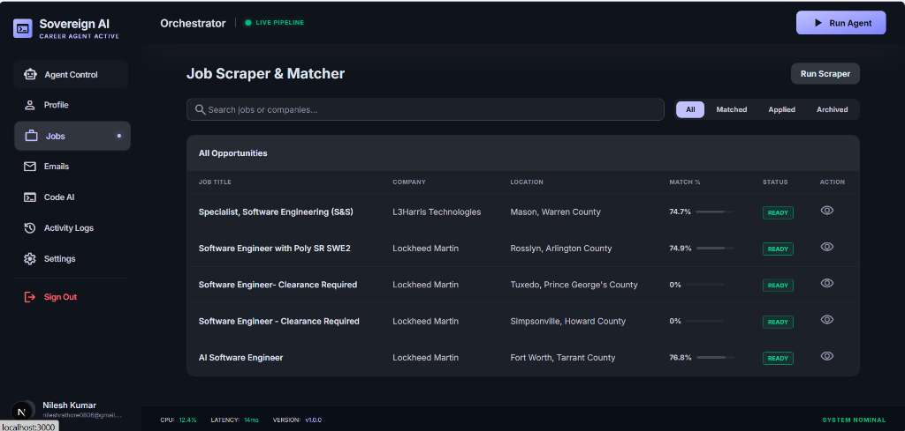
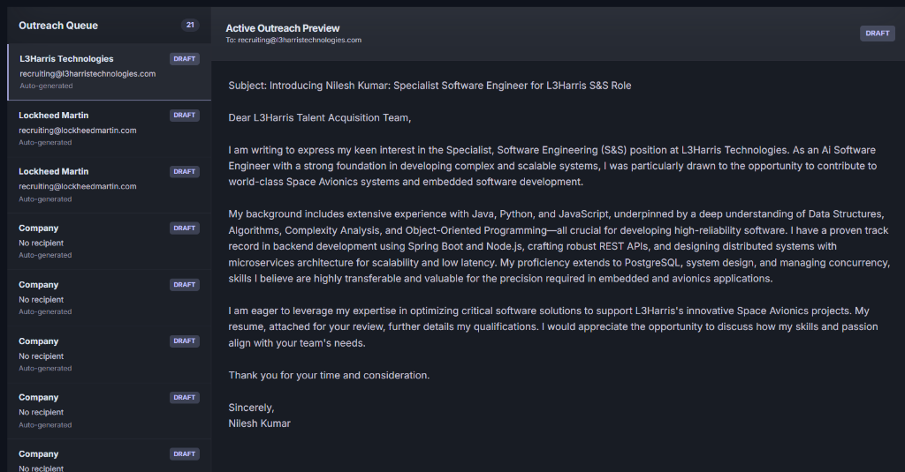

The **Sovereign AI** project is an autonomous career management platform designed to automate the most tedious parts of finding a job. Instead of manually searching boards, adjusting your resume, and hunting for recruiter emails, this system acts as a personal AI pipeline that handles job discovery, semantic matching, and personalized cold-outreach asynchronously.


*Job Discovery and Matcher View*


*AI-Generated Outreach Preview*

## Why This Project? & How It Works
The job search process today is incredibly repetitive. This project solves that by employing an **Agentic Pipeline**. You provide your profile/resume once, and the backend spins up a background worker (or "Agent") that continuously finds jobs, uses LLMs to score them against your resume, finds real human contacts for those jobs, and drafts personalized emails ready for you to send.

## The Technology Stack: What We Use and Why

| Layer | Technology | Why We Chose It |
|-------|------------|-----------------|
| **Frontend** | Next.js 16, React 19, Tailwind 4 | Next.js App Router provides extremely fast page loads and server-side features. Tailwind enables rapid implementation of premium, modern UI designs like the split-screen dashboard without writing custom CSS files. |
| **Backend** | FastAPI, Python 3.11 | Python is the industry standard for AI and agent development. FastAPI provides lightning-fast performance, automatic API documentation, and strict type checking via Pydantic. |
| **Database** | MongoDB | A NoSQL document database is perfect for storing unstructured, nested AI-generated data (like variable job postings, dynamic agent logs, and JSON-based AI match schemas) without needing rigid database migrations. |
| **Queue** | Celery + Redis | AI API calls and web scraping often take 10-60 seconds. Doing this on the main web server would cause timeouts. Celery offloads these heavy agent workflows to background workers, while Redis acts as the fast message broker handling the queue. |
| **AI Models** | Google Gemini | Used for LLM text generation (drafting emails, summarizing jobs) and Text Embeddings (mathematically scoring how well your resume matches a job description). It is extremely fast and cost-effective for multi-step agent chaining. |
| **Job Data** | Adzuna API | Provides live, structured API access to thousands of current job postings. |
| **Outreach** | Hunter.io API | Automatically scrapes and verifies current HR/Recruiter email addresses based on the job posting's company domain. |
| **Auth** | JWT + Google OAuth | Allows seamless, secure "one-click" passwordless logins. |
## Architecture

```
┌─────────────────────────────────────────────────────┐
│                    Frontend (Next.js 16)             │
│  ┌──────────┐ ┌──────────┐ ┌──────────┐ ┌────────┐ │
│  │Dashboard │ │  Jobs    │ │ Emails   │ │Settings│ │
│  │ + Stats  │ │ + Match  │ │ + Draft  │ │ + Keys │ │
│  └──────────┘ └──────────┘ └──────────┘ └────────┘ │
│  ┌──────────┐ ┌──────────┐ ┌──────────┐            │
│  │ Profile  │ │ Code AI  │ │  Logs    │            │
│  └──────────┘ └──────────┘ └──────────┘            │
└───────────────────────┬─────────────────────────────┘
                        │ REST API
┌───────────────────────┴─────────────────────────────┐
│                 Backend (FastAPI)                     │
│  ┌────────────┐ ┌────────────┐ ┌────────────┐       │
│  │ Auth (JWT  │ │ Agents API │ │ Background │       │
│  │ + Google)  │ │ + Profile  │ │  Workers   │       │
│  └────────────┘ └────────────┘ └──────┬─────┘       │
│                                       │              │
│  ┌────────────────────────────────────┘              │
│  │  AI Agent Pipeline                                │
│  │  ┌─────────┐ ┌─────────┐ ┌─────────┐ ┌────────┐│
│  │  │Job Agent│→│Match    │→│HR Agent │→│Email   ││
│  │  │(Adzuna) │ │(Gemini) │ │(Hunter) │ │(Gemini)││
│  │  └─────────┘ └─────────┘ └─────────┘ └────────┘│
│  └──────────────────────────────────────────────────│
└───────────────────────┬─────────────────────────────┘
              ┌─────────┴─────┐
              │   MongoDB     │
              │   Redis       │
              └───────────────┘
```

## Tech Stack

| Layer      | Technology                          | Key Features                      |
|------------|-------------------------------------|-----------------------------------|
| Frontend   | Next.js 16, React 19, Tailwind 4    | Type-Safe architecture, Glassmorphism UI |
| Backend    | FastAPI, Pydantic, Python 3.11      | Async matching, Structured responses |
| Database   | MongoDB (PyMongo)                   | Dynamic AI-generated job archiving |
| Queue      | Celery + Redis                      | Asynchronous agent pipeline sync  |
| AI         | Google Gemini (text + embeddings)   | Semantic scoring & email drafting  |
| Auth       | JWT + Google OAuth 2.0              | Secure dashboard access           |
| APIs       | Adzuna Jobs, Hunter.io, GitHub      | Real-world data integration        |

## Project Structure

```text
agent-ai/
├── backend/                  # FastAPI Application
│   ├── app/                  # Main application code
│   │   ├── core/             # Security, settings, and JWT config
│   │   ├── agents/           # AI Pipeline agents (Job, Match, HR, Email)
│   │   ├── workers/          # Celery background workers
│   │   └── main.py           # FastAPI entry point
│   ├── requirements.txt      # Python dependencies
│   ├── Dockerfile            # Backend container definition
│   └── agent_local.db        # Local SQLite fallback/cache DB
├── frontend/                 # Next.js 16 Application
│   ├── src/                  # React source code
│   │   ├── app/              # App Router (Pages & Layouts)
│   │   └── components/       # Reusable UI components & Dashboard
│   ├── package.json          # Node dependencies
│   ├── tailwind.config.ts    # Tailwind v4 configuration
│   └── Dockerfile            # Frontend container definition
├── docker-compose.yml        # Orchestrates Frontend, Backend, Redis, MongoDB
├── .env / .env.local         # Environment variables (do not commit)
└── README.md                 # Project documentation
```

## Quick Start

### Prerequisites
- Python 3.11+
- Node.js 22+
- MongoDB (Atlas or local)
- Redis (for background tasks)

### 1. Backend Setup
```bash
cd backend
cp .env.example .env          # Fill in your API keys
python -m venv venv
venv\Scripts\activate          # Windows
pip install -r requirements.txt
uvicorn app.main:app --reload --port 8000
```

### 2. Frontend Setup
```bash
cd frontend
cp .env.example .env.local
npm install
npm run dev
```

### 3. Docker (Alternative)
```bash
docker-compose up --build
```

Open [http://localhost:3000](http://localhost:3000)

## Environment Variables

### Backend (`backend/.env`)
| Variable | Required | Description |
|----------|----------|-------------|
| `DATABASE_URL` | ✅ | MongoDB connection string |
| `SECRET_KEY` | ✅ | JWT signing key |
| `GEMINI_API_KEY` | ✅ | Google Gemini API key |
| `GOOGLE_CLIENT_ID` | ❌ | For Google OAuth login |
| `GOOGLE_CLIENT_SECRET` | ❌ | For Google OAuth login |
| `ADZUNA_APP_ID` | ❌ | Adzuna job API |
| `ADZUNA_API_KEY` | ❌ | Adzuna job API |
| `HUNTER_API_KEY` | ❌ | Hunter.io email lookup |
| `GITHUB_TOKEN` | ❌ | GitHub repo analysis |

### Frontend (`frontend/.env.local`)
| Variable | Default | Description |
|----------|---------|-------------|
| `NEXT_PUBLIC_API_URL` | `http://localhost:8000` | Backend API URL |

## Step-by-Step AI Pipeline Breakdown

Here is a detailed breakdown of how the core AI pipeline operates asynchronously:

### 1. Job Discovery (The Adzuna API)
* **What it does:** Fetches real jobs instead of generic mock data.
* **How it works:** When you submit your preferred job title (e.g., "Software Engineer") and location, the backend queries the Adzuna API. Adzuna acts as an aggregation engine, returning a massive list of jobs in JSON format, containing the exact job title, company name, location, and the full job description. 

### 2. Semantic Matching (Google Gemini Text Embeddings)
* **What it does:** Ranks the fetched jobs to see which ones *actually* match your specific resume logically, bypassing simple keyword matching.
* **How it works:** Google Gemini takes the text of your resume and the text of a new job description and converts both into "Embeddings" (mathematical vectors that represent the *meaning* of the text). The backend compares your resume's vector against the job description's vector using cosine similarity. High similarity means a strong semantic match, allowing the system to discard bad matches.

### 3. HR Contact Lookup (Hunter.io API)
* **What it does:** Finds real people working at the company for cold outreach.
* **How it works:** Once the system finds a great job match, it extracts the company name (e.g., "Acme Corp"). The backend uses Hunter.io to find the company's domain (`acmecorp.com`) and searches its database for email formats. It specifically targets email addresses mapped to titles like "Talent Acquisition," "Technical Recruiter," or "HR Manager".

### 4. AI Email Drafting (Google Gemini Text Generation)
* **What it does:** Drafts a highly personalized cold-outreach email tailored precisely to the job and company.
* **How it works:** The backend provides Gemini with your resume, the job description, and the recruiter's contact info. By using a strict instructional prompt, Gemini returns a polished, ready-to-send cold email that naturally references why your past experience aligns perfectly with that specific role.

### 5. Background Queue Orchestration (Celery & Redis)
* **What it does:** Acts as the "traffic controller" so the application doesn't crash while executing the heavy pipeline.
* **How it works:** Steps 1 through 4 are extremely time-consuming (fetching APIs, processing models). If the Next.js dashboard had to wait synchronously, the browser would time out. Instead, the FastAPI backend instantly hands the pipeline instructions to **Redis** (the fast message broker). **Celery** (the background worker) picks those instructions up, quietly runs the heavy logic in the background, and saves the final result securely in MongoDB for you to view in the dashboard.

### 6. Security & State (JWT & MongoDB)
* **What it does:** Keeps your pipeline data secure and isolated.
* **How it works:** When you log in with Google OAuth, the backend issues you a JSON Web Token (JWT). Every time the frontend asks for your AI-generated emails or job matches, the backend strictly validates the JWT to find your specific user ID, ensuring that nobody else can see your tailored job records within the MongoDB database.

## License

MIT
